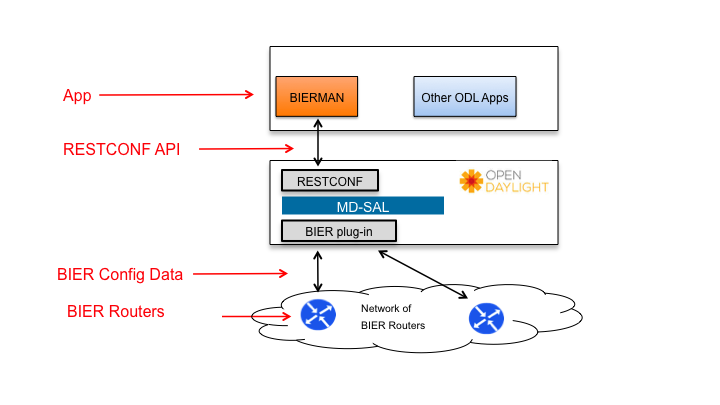

# BIERMAN (v0.1)
OpenDaylight (ODL) is an open-source application development and delivery platform. BIERMAN is an application designed and implemented to run on top of ODL to visualize BIER network topologies, create/manage BIER multi-point paths and enable mapping of video content to BIER paths. In addition stats are collected and displayed.


# Development Team
* Chris Metz (chmetz@cisco.com)
* Greg Shepherd (shep@cisco.com)
* IJsbrand Wijnands (ice@cisco.com)
* Gaofeng Tao
* Alexei Zverev (alzverev@cisco.com)


## Application Overview

Bit Indexed Explicit Replication (BIER) is a revolutionary new multipoint forwarding architecture. BIER allows for network replication without a tree building protocol or per-flow state by providing a mechanism to define endpoints within the packet header. BIER routers replicate and forward multicast packets along the unicast shortest paths to each of the defined endpoints for any given packet. This is a radical simplification over all previous multi-point solutions, reducing the cost of operation and providing deterministic network convergence performance for multicast services.

As mentioned BIERMAN runs on top of ODL and provides the operator with an easy to use WEB interface for managing bier networks and the video content running over them. The architecture for the BIERMAN application is shown in the figure below.



The architectural components consist of:

- network of BIER-configured routers
- ODL controller supporting a "southbound" BIER configuration plug-in essentionally enabling the BIER to receive path management and video channel mapping information passed down from the application.
- ODL platform that consumes BIER YANG models and auto-generates a set of REST APIs that applications (like BIERMAN) can use. RESTCONF is the term used to describe REST APIs that are generated from YANG models by ODL
- BIERMAN application

### BIERMAN Topology
Below is a screenshot depicting the initial network topology of bier routers learned from ODL and rendered on the screen. The topology was communicated up to ODL using BGP-LS. BIERMAN then retrieved the topology by calling the BGP-LS REST API. This topology view based on BGP-LS is used in other ODL applications that manage IP/MPLS Networks.

<div>

</div>


### BIERMAN Channel Manager
The tabs shown across the top bar support a number of different BIERMAN functions. The first is Channel Manager which is used by BIERMAN add, modify, delete and list content channels that can be mapped to a BIER multipoint path.

The figure below is a screenshot of the Channel Manager.

<div>

</div>


### BIERMAN Path Manager

Path Manager is used to create a content-bearing multi-point path. The path can be computed automatically based on the SPF path computation function or the user can explicitly point/click to each router and link between the source and one or more egress or receiver routers.

The first screenshot shows the path manager slide-out panel. The user can select click/point to the source and egress routers if automatic computation (SPF) is selected or the source, egress routers and intermediate loop-free routers and links that would make up the multipoint path. BIERMAN validates the multipoint path against the entire topology and if successful generates a unique Path ID.


The user can then assign a channel (defined in the Channel Manager) to the specific path. When that information is deployed into the network through ODL and all the way down to the routers, a success message is shown as depicted in the screenshot below.

<div>

</div>

The advantags of BIERMAN are twofold: first it simplifies the mapping of content channels to a stateless multipoint path and second it is build entirely on open source software components. The latter is important as users and developer might want to customize certain aspects of managing their own BIER networks.

#BIER Information

IETF [BIER WG Charter](https://datatracker.ietf.org/wg/bier/charter/)

IETF [BIER WG Documents](https://datatracker.ietf.org/wg/bier/documents/)

#Configuration

## 3-step Setup

### REST Proxy Server
We use [ODL REST Proxy](https://github.com/zverevalexei/odl-rest-proxy) to avoid CORS restrictions. Proxy enhances possibilities of REST API, since we can make even 'unsafe' requests.

Open the file /web/app/bierman.controller.js and find the object '$scope.appConfig'.

Modify its properties 'proxyHost' and 'proxyPort' so that they are your actual data. You may want to leave the data as is if you don't locate proxy on a remote computer or you didn't change the port number.
- **proxyHost** points to proxy's IP address (or a host name)
- **proxyPort** points to proxy's port

You may use auto detection of IP address if you intend to use BIERMAN on remote machines. 

### Controller Settings
Open the file start_bierman.js and find the object 'appConfig'.

Modify its properties 'ctrlHost', 'ctrlPort', 'ctrlUsername' and 'ctrlPassword' so that they are your actual data.
- **ctrlHost** points to controller's IP address (or a host name)
- **ctrlPort** points to controller's port
- **ctrlUsername** and **ctrlPassword** are credentials to authorize on the server

You may also want to adjust **proxyPort** and **webServerPort** if this is necessary.

### Running GUI (easy as pie)
1. Have [NodeJS](https://nodejs.org) installed on your computer
2.  Using 'cd' command go to root folder of BIERMAN and run the command in terminal:

  ```
  node start_bierman.js
  ```
3. Point your browser to http://{{IP address where GUI deployed}}:8080 and enjoy. We recommend using Chrome. 

# Additional Information
This is a web application developed to manage multipoint content over BIER networks. It implemented on top of OpenDaylight with means of [Angular](http://github.com/angular/angular.js), [Angular Material](https://github.com/angular/material) and [NeXt UI](http://github.com/CiscoDevNet/next-ui). Pure open-source product.

This package includes just the BIERMAN overview, source code and installation instructions. Parties who download this software will need to install their own version of ODL have it point to a physical or virtual network of BIER routers. Instructions on how to accomplish this will be provided in this document in the near future.
